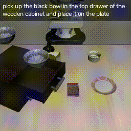
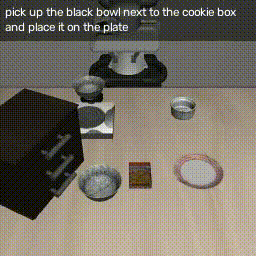
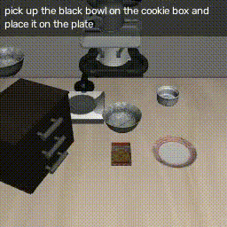
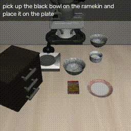

Dum-E — VLA playground
======================

A lightweight repo for training a VLA-style model on the LeRobot/Libero spatial image dataset.

Think of this as a tinkering playground: dataset loaders, a small model in `model/`, and a minimal training loop in `scripts/train.py`.

The model uses a SmolVLM visual language backbone(Configurable) + a flow matching action head to predict actions conditioned on the language instruction and the image input. 

Results
----------

Below are example runs demonstrating the Dum-E model behavior on Libero spatial environment.

<p align="center">
	
	
    
    
</p>

Quickstart
----------

- Create a virtualenv and install dependencies (Or create a docker image using the docker file):

```bash
python -m venv .venv
source .venv/bin/activate
pip install -r requirements.txt
```

- Data: the repo expects datasets under `datasets/`.

- Train locally (CPU/GPU):

```bash
# basic run (draccus flags accepted via CLI)
python scripts/train.py --seed 42 --num_epochs 10

# if you use wandb, pass --use_wandb True and set project/run flags
python scripts/train.py --use_wandb True --wandb_project myproj --wandb_run_name quicktest
```

What lives where
-----------------

- `scripts/train.py` — minimal training loop
- `model/` — model code and `VLAConfig` (`vla.py`, `config.py`, `vlm_backbone.py`, `action_head.py`).
- `datasets/` — dataset shards and helpers for `LeRobotDataset` (this project expects `lerobot/libero_spatial_image`).
- `Dockerfile` — lightweight container for reproducible runs (tweak as needed).

Config and tuning
-----------------

The training script uses a configuration dataclass `VLAConfig` (see `model/config.py`). You can pass overrides on the command line via `draccus` flags — e.g. change learning rate, batch size, or number of epochs without editing code.

Logging and checkpoints
-----------------------

- Checkpoints are saved as `checkpoint_epoch{epoch}.pt` from the training loop.
- Optional Weights & Biases integration is supported. Enable it with `--use_wandb True` and pass `--wandb_project` / `--wandb_run_name`.

Quick tips
----------

- For GPU training, ensure CUDA is available and the env has the right drivers. The code auto-selects `cuda` if available.
- If you run out of memory, reduce `train_batch_size` in the config or lower the model size in `model/`.

Have fun! — Dum-E (a friendly training bot)
